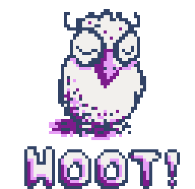

# Hoot



This repo is for updates to "Hoot", the codename for the
[Guile->WebAssembly
project](https://spritely.institute/news/guile-on-web-assembly-project-underway.html)
launched by the [Spritely Institute](https://spritely.institute/).  As
work on Hoot progresses, updates will be posted here!

## Project goals and time-frame

Hoot aims to be an ahead-of-time compiler for all of [R7RS-small
Scheme](https://small.r7rs.org/) to WebAssembly.  We are targetting the
WebAssembly extensions that appear ready to ship in Q4 2023, notably
including garbage collection and tail calls, and hope to reach our goal
in Jully 2023.

Hoot is being developed here and in [Spritely's Guile development
branches](https://gitlab.com/spritely/guile).  This repository is for
tracking history and design decisions as the project progresses, and for
experimentations.

After completing R7RS support, we will move on to a full Guile port,
including delimited continuations and so on.  We are keeping this
end-goal in mind as we build the early deliverable.

Resulting code should all run on stock Guile.  We may need to upstream
some patches to Guile, and will do so as it seems appropriate.

## But... why the name "Hoot"?

We thought this project deserved a cute project name and mascot, and
everyone at the time agreed an owl was nice, and Christine
Lemmer-Webber had recently just drawn up this owl pixel art, and
so it became the mascot.
The name naturally flowed from there.

## Updates

See the [log file](design/log.md).

## GitLab CI

Here's how to build a Docker image for use in GitLab CI.  Guix
produces the actual image, but Docker is required to upload it to the
GitLab container registry.

If this is your first time using the GitLab registry, login:

```
docker login registry.gitlab.com
```

Build and upload the image:

```
guix pack -m manifest.scm -f docker -S /bin=bin
docker load < $pack-from-prev-cmd
docker tag $image-name-from-prev-cmd:latest registry.gitlab.com/spritely/guile-hoot-updates
docker push registry.gitlab.com/spritely/guile-hoot-updates
```
